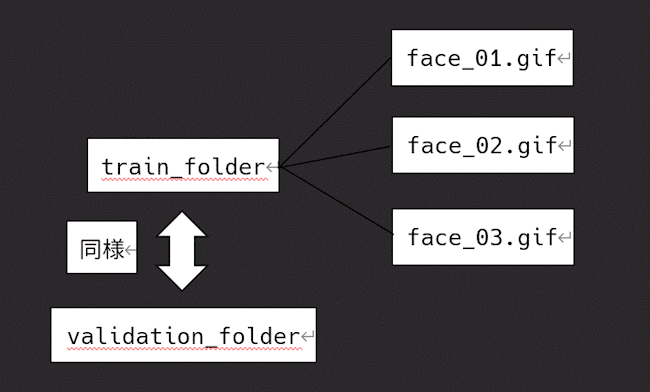

### 前処理とデータ加工の履歴 (2025/11/24)

- 機械学習ライブラリから、独自顔写真を分析対象にした。

- k-means、PCA、NMFをscikit-leansから分析できるようにサンプルを書いた。

- 通常の顔写真サンプルをグレースケールにして、分析できるようにした。

- 通常の機械学習を実行、値が3種類に変わるように見える。

- tensorflow/keras、学習モデルを作って出力した。(検証中)

  ※ 環境に応じて、モデルの内容を調整する必要あり。

- 多対多の顔認識、主成分分析を用いて近似値評価のための中央値を計算で導いた。

  ※  用途として、最小値と最大値をIF文などの条件式で設定し使用する。

- プロジェクト内で実行できるようにパッケージ化 + PyPiに登録した。

- トレーニングデータ、テストデータをまとめと個別に出力するようにした。

- PyPiパッケージは、プロジェクトに依存しています。外部からコンソールに出力はできません。

- PyPiパッケージは、数値の出力(統合版、部品化)のみ対応しています。個別はプロジェクトを使ってください。

- analyzeフォルダ、近似値評価をif文で条件分岐する処理を書いた。用途で処理を追加する。

```markdown
# 近似値評価を実行する
python run.py
```

```markdown
# 現在のバージョン、出力結果
rock_ptarmigan version: 1.0.2
Approximate value : 0.15 in train folder.
Approximate value : 0.11 in validation folder.
0.15
0.11
```

