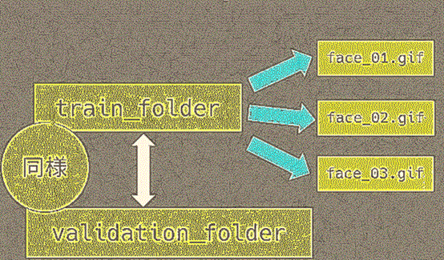

### データ分析のため、前処理と機械学習の説明文。

- [x] 機械学習ライブラリから、独自顔写真を分析対象にした。

- [x] k-means、PCA、NMFをscikit-leansから分析できるようにサンプルを書いた。

- [x] 通常の顔写真サンプルをグレースケールにして、分析できるようにした。

- [x] 通常の機械学習を実行、値が3種類に変わるように見える。

- [x] tensorflow/keras、学習モデルを作って出力した。

  ※ 検証結果として、環境に応じてモデルの内容を調整する必要あり。

- [x] 多対多の顔認識、主成分分析を用いて近似値評価のための中央値を計算で導いた。

  ※ 用途として、最小値と最大値をIF文などの条件式で設定し使用する。

- [x] プロジェクト内で実行できるようにパッケージ化 + PyPiに登録した。

- [x] トレーニングデータ、テストデータをまとめと個別に出力するようにした。

- [x] PyPiパッケージは、プロジェクトに依存しているので、外部からコンソールに出力はできない。

- [x] PyPiパッケージは、数値の出力(統合版、部品化)のみ対応しているため、個別はプロジェクトを使う。

- [x] analyzeフォルダ、近似値評価をif文で条件分岐する処理を書いた。用途で処理を追加する。

- [x] numeric_calc.py → rock_ptarmiganに導入しました。

- [x] 出力結果のメッセージを英文化しました。

```markdown
rock_ptarmigan version: 1.0.5
--------------------------------------------------------------
Mean: 0.09
Median: 0.09
STDEV: 0.005
Minimum: 0.08
Maximum: 0.10
--------------------------------------------------------------
Mean: 0.11
Median: 0.11
STDEV: 0.009
Minimum: 0.10
Maximum: 0.12
--------------------------------------------------------------
--------------------------------------------------------------
Mean: 0.09
Median: 0.09
STDEV: 0.005
Minimum: 0.08
Maximum: 0.10
--------------------------------------------------------------
--------------------------------------------------------------
Mean: 0.11
Median: 0.11
STDEV: 0.009
Minimum: 0.10
Maximum: 0.12
--------------------------------------------------------------
```


